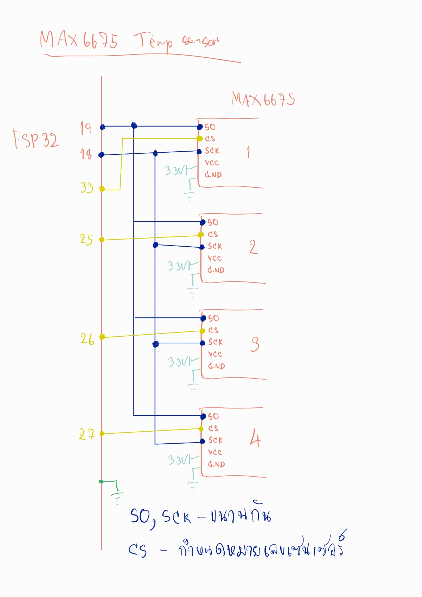
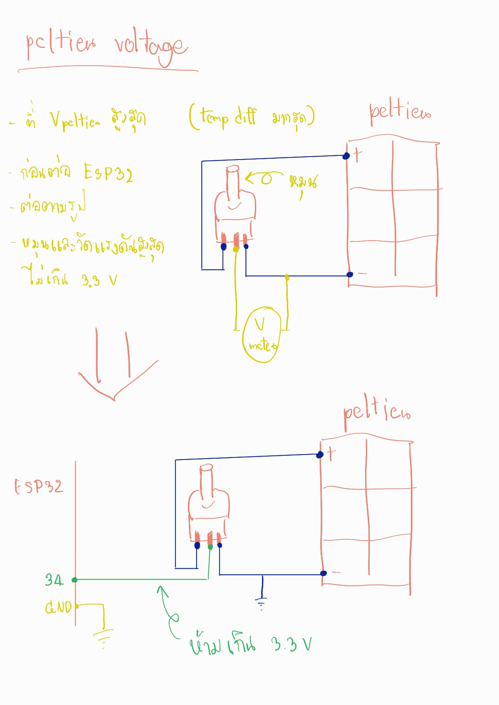
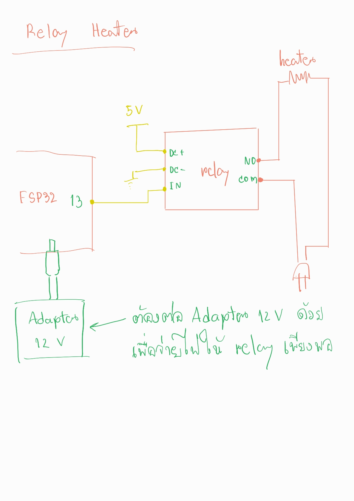

# Peltier project
## การตั้งค่าโค้ด

 - เซนเซอร์อุณหภูมิที่ควบคุม relay heater [ตัวอย่างใช้เซนเซอร์ตัวที่4ควบคุม Heater] ได้ที่
  `#define HEATTER_CONTROL 4   // temp sensor ตัวที่ต้องการควบคุม heater`
  - กำหนดอุณหภูมิที่ต้องการ ได้ที่
  `#define HEATTER_TEMP 35     // temp ที่ต้องการให้ heater ตัดการทำงาน`
 - กำหนดเวลาที่ต้องการอัพเดทค่าขึ้น google sheet หน่วยเป็นวินาที ได้ที่
  `#define GSHEETUPDATE 60   // เวลา update ขึ้น gsheet [sec]`
  - ใส่ชื่อไวไฟและรหัสผ่านได้ที่
   `char ssid[] = "ssid";`
`char pass[] = "pass";`
 - กำหนดลิ้งของ google sheet ที่ต้องการได้ที่
  `String gsheet_url = "https://script.google.com/macros/xxxxxxxxxxxxxx`
  - สร้างไฟล์ google sheet ใหม่ ตัวอย่างที่ https://iotkiddie.com/blog/esp8266-data-to-google-sheet/

## การต่อวงจร
### max6675 temp sensor

 - มี4ตัว ต่อขนานกัน
 - pin SO,SCK ต่อขนานกัน
 - ไฟเลี้ยง 3.3V [5vก็ได้เหมือนกัน]
 - pin CS ใช้กำหนดลำดับเซนเซอร์

### peltier voltage sensor

 - วอลลุ่มเปรียบเป็นวงจรแบ่งแรงดัน แต่สามารถปรับค่าได้จากการหมุน
 - **ก่อนต่อเข้า esp32** ให้ทดลองให้ได้แรงดันไม่เกิน 3.3v
 - ทดลองในเงื่อนไขที่คาดว่าจะได้แรงดันจาก peltier **มากที่สุด**[อุณหภูมิต่างกันมากสุด]
 - โดยต่อตามรูปแรกก่อน
 - ไฟ +- เข้าขาริม[ด้านไหนก็ได้]
 - ใช้มิเตอร์วัดแรงดันขากลางเทียบกับ -
 - ลอง**หมุนปรับวอลลุ่ม**ซ้ายขวาให้แรงดันสูงสุด**ไม่เกิน 3.3v**
 - เมื่อตำแหน่งที่แรงดัน**ไม่เกิน 3.3v** แล้ว
 - ให้ต่อตามรูปสอง โดยต่อขากลางเข้าขา adc **pin 34**
 - ขา - ต่อ gnd

### peltier voltage sensor

 - relay เปรียบเป็น**สวิต**ที่ควบคุมด้วยไฟฟ้า
 - ตัดสายไฟ 1 เส้น แล้วต่อเข้า **ขา COM และ NO** ของ relay ตามรูป [สลับขาได้]
 - ต้องเสียบ **adapter 12v** เข้าฐานตัว esp32 ด้วย เพื่อให้จ่ายไฟให้ relay เพียงพอ[ตอนทดลองยังไม่เสียบก็ได้ แต่รีเลย์จะไม่ทำงาน]
 - กำหนดอุณหภูมิที่ต้องการที่
   `#define HEATTER_TEMP 35     // temp ที่ต้องการให้ heater ตัดการทำงาน`
  - การทำงานคือ เมื่ออุณหภูมิ**น้อยกว่า 35C** Relay จะสั่งเปิด ให้ heater ทำงาน
  - เมื่ออุณหภูมิ**สูงกว่า 35C** Relay จะตัดการทำงานไม่ให้ heater ทำงาน
  - และ Relay จะทำงานอีกเมื่ออุณหภูมิ**ต่ำกว่าที่ตั้งไว้ -1** [35-1=**34C**] และจะหยุดทำงานเมื่ออุณหภูมิ 35C
  - ให้มี gap 1C เพื่อไม่ให้ relay เปิดปิดการทำงานถี่เกินไป
  - เป็นหลักการเดียวกัน**แอร์ fix speed**
